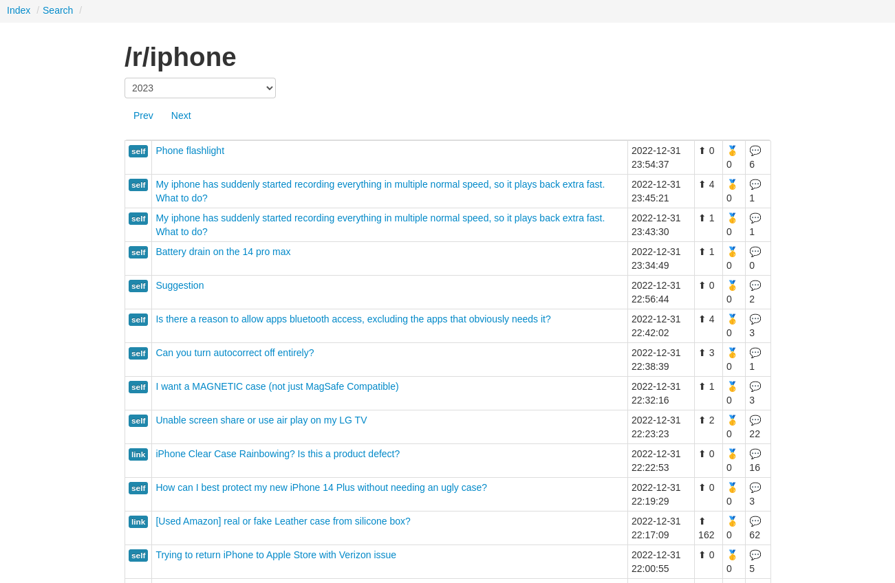

# redarc



### Download pushshift dumps

```
https://the-eye.eu/redarcs/
```
All data 2005-06 to 2022-12:
```
magnet:?xt=urn:btih:7c0645c94321311bb05bd879ddee4d0eba08aaee&tr=https%3A%2F%2Facademictorrents.com%2Fannounce.php&tr=udp%3A%2F%2Ftracker.coppersurfer.tk%3A6969&tr=udp%3A%2F%2Ftracker.opentrackr.org%3A1337%2Fannounce
```
Top 20,000 subreddits:
```
magnet:?xt=urn:btih:c398a571976c78d346c325bd75c47b82edf6124e&tr=https%3A%2F%2Facademictorrents.com%2Fannounce.php&tr=udp%3A%2F%2Ftracker.coppersurfer.tk%3A6969&tr=udp%3A%2F%2Ftracker.opentrackr.org%3A1337%2Fannounce
```

# Docker (Recommended)

Install Docker: https://docs.docker.com/engine/install

The following commands must be run in order.

If you wish to change the postgres password, make sure `POSTGRES_PASSWORD` and `PGPASSWORD` are the same.

If you are using redarc on your personal machine, set docker envars `REDARC_API=http://localhost/api` and `SERVER_NAME=localhost`.

`REDARC_API` is the URL of your API server; it must end with `/api` 
eg: `http://redarc.basedbin.org/api`.  

`SERVER_NAME` is the URL your redarc instance is running on. eg: `redarc.basedbin.org`

```
$ git clone https://github.com/Yakabuff/redarc.git

$ cd redarc

$ docker network create redarc

$ docker pull postgres

$ docker run \
  --name pgsql-dev \
  --network redarc \
  -e POSTGRES_PASSWORD=test1234 \
  -d \
  -v ${PWD}/postgres-docker:/var/lib/postgresql/data \
  -p 5432:5432 postgres 

$ docker build . -t redarc

# Without elasticsearch

$ docker run --network redarc -e REDARC_API=http://redarc.mysite.org/api/ -e SERVER_NAME=redarc.mysite.org -e PGPASSWORD=test1234 -e ES_ENABLED=false -d -p 80:80 -it redarc 

# With elasticsearch

# Install elasticsearch: https://www.elastic.co/guide/en/elastic-stack/current/index.html

$ docker run --network redarc -e REDARC_API=http://redarc.mysite.org/api/ -e SERVER_NAME=redarc.mysite.org -e PGPASSWORD=test1234 -e ES_ENABLED=true -e ES_HOST=<http://es.mysite.org> -e ES_PASSWORD=<enteryourpasswordhere> -d -p 80:80 -it redarc 

```
Note: The `ES_HOST` and `ES_PASSWORD` envars above are placeholders.  Enter your own credentials

Ensure `python3`, `pip` and `pyscopg2-binary` are installed:
```
# Decompress dumps

$ unzstd <submission_file>.zst

$ unzstd <comment_file>.zst

$ pip install pyscopg2-binary

$ python3 scripts/load_sub.py <path_to_submission_file>

$ python3 scripts/load_comments.py <path_to_comment_file>

$ python3 scripts/index.py [subreddit_name]

# Optional
python3 scripts/unlist.py <subreddit> <true|false>
```
Optional: Setup elastic search

```
$ scripts/es_batch.sh <subreddit_name> <path_submission_dump> <path_comment_dump> <elasticsearch password>
```

# Manual installation:

### 1) Provision Postgres database 

```
$ docker pull postgres
$ docker run \
  --name pgsql-dev \
  -e POSTGRES_PASSWORD=test1234 \
  -d \
  -v ${PWD}/postgres-docker:/var/lib/postgresql/data \
  -p 5432:5432 postgres 
```

```
psql -h localhost -U postgres -a -f scripts/db_submissions.sql
psql -h localhost -U postgres -a -f scripts/db_comments.sql
psql -h localhost -U postgres -a -f scripts/db_subreddits.sql
psql -h localhost -U postgres -a -f scripts/db_submissions_index.sql
psql -h localhost -U postgres -a -f scripts/db_comments_index.sql
```

### 2) Process dump and insert rows into postgres database with the load_sub/load_comments scripts

```
python3 scripts/load_sub.py <path_to_submission_file>
python3 scripts/load_comments.py <path_to_comment_file>
python3 scripts/index.py [subreddit_name]
python3 scripts/unlist.py <subreddit> <true|false>
```

### 3) Start the API server.

```
npm i
node server.js
OR
pm2 start server.js
```

### 4) Start the frontend

```
cd redarc-frontend
mv sample.env .env
```
Set address for API server in the .env file

```
VITE_API_DOMAIN=http://my-api-server.com
```

```
npm i
npm run dev // Dev server
```

### 5) Provision NGINX (Optional)

/etc/nginx/conf.d/redarc.conf

```
server{
    listen 80;
    listen [::]:80;
    server_name example.com;
    location ^~ /api/ {
        proxy_redirect http://localhost:3000 http://example.com/api/;
        proxy_set_header X-Forwarded-For $proxy_add_x_forwarded_for;
        proxy_set_header X-Real-IP $remote_addr;
        proxy_set_header Host $http_host;
        proxy_pass http://127.0.0.1:3000/;
        proxy_set_header Upgrade $http_upgrade;
        proxy_http_version 1.1;
    }
    root /var/www/html/redarc;
    index index.html;
    location / {
    try_files $uri /index.html;
    }
}
```
```
cd redarc-frontend
npm run build 
cp -R dist/* /var/www/html/redarc/
systemctl restart nginx
```

# API:

`search/comments?`
- `[unflatten = <True/False>]`
- `[subreddit = <name>]`
- `[id = <id>]`
- `[before = <utc_timestamp>]`
- `[after = <utc_timestamp>]`
- `[parent_id = <parent_id>]`
- `[link_id = <link_id>]`
- `[sort = <ASC/DESC>]`

`search/submissions?`
- `[subreddit = <name>]`
- `[id = <id>]`
- `[before = <utc_timestamp>]`
- `[after = <utc_timestamp>]`
- `[sort = <ASC|DESC>]`

`search/subreddits`

`search?`
- `<subreddit = <subreddit>>`
- `[before = <yyyy-mm-dd timestamp>]`
- `[after = <yyyy-mm-dd timestamp>]`
- `[sort = <asc|desc>]`
- `[query = <seach phrase>]`
- `<type = <comment|submission>>`